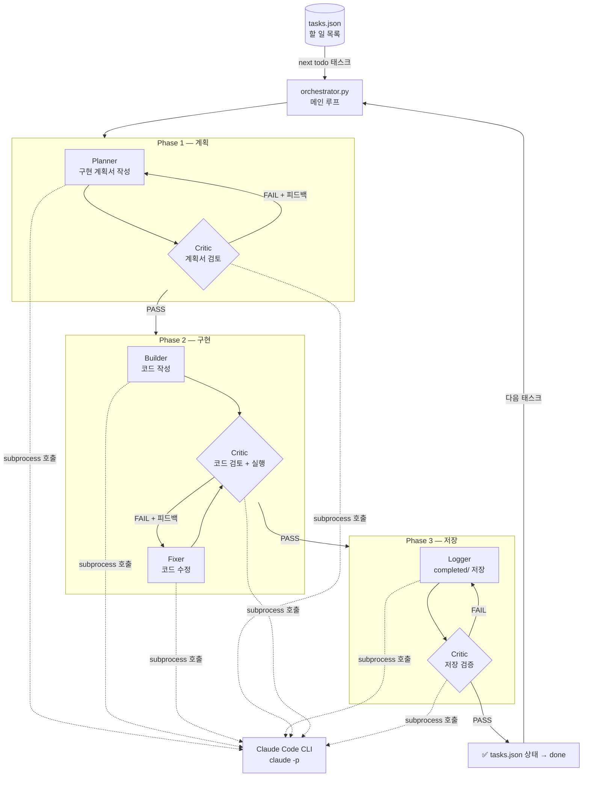

# 🤖 Multi-Agent Automation Factory

태스크를 입력하면 AI 에이전트 팀이 **계획 → 구현 → 검토 → 저장** 파이프라인을 자동으로 실행해 완성된 Python 프로젝트를 만들어내는 자율 빌드 시스템.

`orchestrator.py`가 Claude Code CLI를 subprocess로 호출해 각 에이전트 역할을 수행시킨다. Critic이 PASS를 줄 때까지 루프가 반복되며, 태스크가 소진되면 새 아이디어를 자동 생성해 계속 실행된다.

---

## 🧩 아키텍처



---

## 👥 에이전트 역할

| 에이전트 | 역할 |
|----------|------|
| 🗺️ **Planner** | 태스크 분석 → 파일 구조, 함수 목록, 실행 흐름, 엣지케이스 포함 계획서 작성 |
| 🏗️ **Builder** | 계획서 기반으로 실제 동작하는 코드 전체 작성 |
| 🔧 **Fixer** | Critic 피드백만 정확히 반영해 코드 수정, 나머지 건드리지 않음 |
| 🔍 **Critic** | 계획서/코드/저장 결과를 PASS/FAIL로 판정, 구체적 피드백 제공 |
| 📦 **Logger** | 완성된 프로젝트를 `completed/` 폴더로 이동·정리 |

---

## 📋 태스크 목록 (기본 20개)

| # | 에이전트 | 설명 |
|---|---------|------|
| 1 | arXiv 논문 요약 | AI/ML 논문 자동 수집 + 한국어 3줄 요약 |
| 2 | GitHub 트렌딩 분석 | 트렌딩 레포 스크래핑 + 주간 비교 |
| 3 | AI 뉴스 인사이트 | RSS 피드 수집 + 핵심 인사이트 추출 + 카테고리 분류 |
| 4 | Meta Ad Library 스크래퍼 | 광고 카피 수집 + CTA 패턴 분석 |
| 5 | 네이버 DataLab 트렌드 | 키워드 급상승 감지 + 30일 그래프 생성 |
| 6 | 경쟁사 블로그 모니터링 | 새 글 감지 + 자동 요약 + 회사별 분류 |
| 7 | 유튜브 트렌딩 분석 | YouTube API로 트렌딩 수집 + 제목 패턴 분석 |
| 8 | 코드 리뷰 | 파일/diff 입력 → 심각도별 리뷰 + 개선 코드 제안 |
| 9 | 회의록 액션아이템 추출 | 회의록 텍스트 → 담당자/데드라인/우선순위 자동 추출 |
| 10 | 커뮤니티 버즈 수집 | 네이버 API 기반 감성 분류 + 긍/부/중립 비율 집계 |
| 11 | 스타트업 펀딩 뉴스 | 투자 뉴스 수집 + 업종별 트렌드 + 월별 비교 |
| 12 | 채용공고 기술스택 트렌드 | 기술스택 빈도 집계 + 상승/하락 감지 |
| 13 | 논문 → 블로그 포스트 | arXiv URL → 일반인용 블로그 글 자동 변환 |
| 14 | 트렌드 → SNS 포스트 | 토픽 → 트위터/링크드인 플랫폼별 포스트 생성 |
| 15 | 뉴스레터 자동 생성 | 주간 결과물 취합 → HTML + MD 뉴스레터 |
| 16 | 아이디어 찬반 토론 | 낙관론자/비판론자/심판 3 에이전트 토론 → 점수 산출 |
| 17 | 비즈니스 아이디어 검증 | TAM/SAM/SOM + 경쟁사 + 수익모델 + MVP 로드맵 |
| 18 | 부동산 상권 데이터 | 공공데이터 API + 개업률/폐업률/유동인구 분석 |
| 19 | 개인 학습 요약 | URL/파일 → 플래시카드 10장 + 핵심 개념 5가지 |
| 20 | 전체 대시보드 | `completed/` 스캔 → HTML 대시보드 생성 + 브라우저 자동 오픈 |

20개 완료 후 Claude가 자동으로 새 에이전트 아이디어를 생성해 계속 실행한다.

---

## ⚙️ 요구사항

- Python 3.11+
- [Claude Code CLI](https://claude.ai/code) 설치 및 로그인 완료 (`claude` 명령 사용 가능 상태)
- Claude Max 구독 권장 (태스크당 수십~수백 회 CLI 호출 발생)

---

## 🛠️ 설치 및 실행

```bash
# 1. 레포 클론
git clone https://github.com/SSEUNGSSEUNGWOO/agents.git
cd agents

# 2. 실행
bash run.sh
```

`run.sh`는 orchestrator가 비정상 종료되면 10초 후 자동으로 재시작한다.
맥북 슬립, 네트워크 끊김으로 죽어도 자동 복구된다.

### 직접 실행 (재시작 없이)

```bash
python orchestrator.py
```

---

## 📁 디렉토리 구조

```
agents/
├── orchestrator.py       # 메인 루프 — 태스크 관리 + 페이즈 실행
├── tasks.json            # 태스크 목록 (todo / in_progress / done)
├── run.sh                # 자동 재시작 래퍼
├── agent_team/
│   ├── planner.py        # 계획서 작성 프롬프트
│   ├── builder.py        # 코드 작성 프롬프트
│   ├── fixer.py          # 코드 수정 프롬프트
│   ├── critic.py         # 검토 프롬프트 + PASS/FAIL 파싱
│   └── logger.py         # 저장 프롬프트 + tasks.json 상태 관리
├── in_progress/          # 현재 작업 중인 프로젝트 (임시)
├── completed/            # 완성된 프로젝트
└── logs/                 # 실행 로그 (날짜별)
```

### 완성된 에이전트 구조

각 에이전트는 독립 실행 가능한 완전한 프로젝트 구조를 가진다.

```
completed/
└── 01_arXiv_논문_요약_에이전트/
    ├── main.py           # 실행 진입점 (python main.py)
    ├── config.yaml       # 전체 설정 (키워드, 경로, 최대 수집 수 등)
    ├── .env.example      # API 키 형식 예시
    ├── requirements.txt  # 의존성 목록
    ├── .gitignore
    └── README.md         # 설치/실행/설정 가이드
```

---

## ⏸️ 일시정지 및 재개

```bash
# 일시정지
pkill -f orchestrator.py && pkill -f run.sh

# in_progress 상태 리셋 (중단된 태스크를 todo로 되돌림)
python3 -c "
import json
with open('tasks.json') as f: d = json.load(f)
for t in d['tasks']:
    if t['status'] == 'in_progress': t['status'] = 'todo'
with open('tasks.json', 'w') as f: json.dump(d, f, ensure_ascii=False, indent=2)
"

# 재개 (완료된 태스크는 자동 스킵)
bash run.sh
```

---

## 📊 진행 상태 확인

```bash
# 실시간 로그
tail -f logs/orchestrator_$(date +%Y%m%d).log

# 태스크 상태 요약
python3 -c "
import json
d = json.load(open('tasks.json'))
for t in d['tasks']:
    icon = '✅' if t['status'] == 'done' else '🔄' if t['status'] == 'in_progress' else '⬜'
    print(f\"{icon} {t['id']:2d}. {t['title']}\")
"
```

---

## 🔍 로그 예시

```
[2026-03-30 17:43:48] 📋 태스크 1: arXiv 논문 요약 에이전트
[2026-03-30 17:44:51] [PLANNER] 초기 계획서 작성 완료
[2026-03-30 17:44:51] [CRITIC] 계획서 검토 #1
[2026-03-30 17:46:03] [CRITIC] 계획서 FAIL → Planner 수정 요청
[2026-03-30 17:47:10] [PLANNER] 계획서 수정 완료 (#1회)
[2026-03-30 17:48:20] [CRITIC] 계획서 통과 (#2회)
[2026-03-30 17:49:30] [BUILDER] 초기 코드 작성 완료
[2026-03-30 17:52:00] [CRITIC] 코드 통과 (#1회)
[2026-03-30 17:53:10] [CRITIC] 저장 통과 (#1회)
[2026-03-30 17:53:10] ✅ 태스크 1 완료: arXiv 논문 요약 에이전트
```

---

## 🧰 기술 스택

| 분류 | 기술 |
|------|------|
| 언어 | Python 3.11+ |
| AI | Claude Code CLI (`claude -p` subprocess 호출) |
| 설계 패턴 | Multi-agent, Critic 루프, 자율 태스크 생성 |
| 상태 관리 | tasks.json (todo / in_progress / done) |
| 안정성 | run.sh 자동 재시작, 에러 시 태스크 스킵 후 계속 실행 |

---

## 📄 라이선스

MIT License
